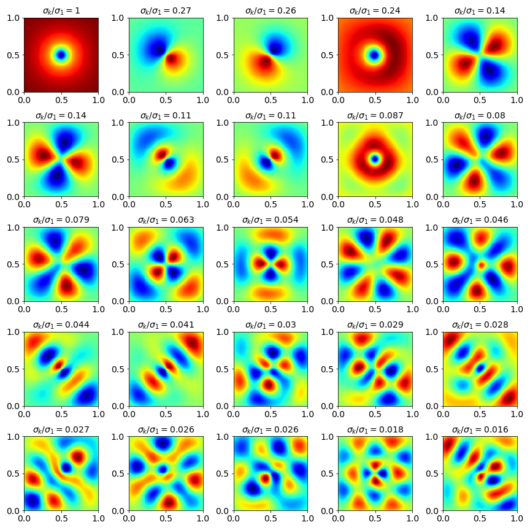
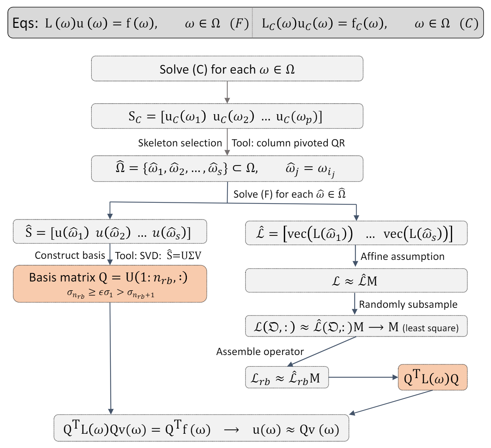

# Coarse-Proxy Model Reduction for Integral Equations

This repository holds the MATLAB companion code for our paper [Coarse-Proxy Model Reduction for Integral Equations](https://arxiv.org/abs/1911.05331). 



## Reproducing the Paper Benchmarks

To simply reproduce the results in the paper, start matlab and enter into the directory **./FLAM**,

```[matlab]
cd FLAM
```

Run the startup script

```[matlab]
startup
```

Then enter into the directory **./src** and run the **mainRTE.m** and **mainBIE.m** scripts for the *Radiative Tranposrt Equation* and *Boundary Integral Equation* examples in the paper respectively.

```[matlab]
cd ./src
mainRTE
mainBIE
```

This will produce two tables **result_table_RTE.mat** and **result_table_BIE.mat** in the **./src** directory. For each selection epsilon in the paper, these hold a corresponding **RBObject** that contains the reduced basis as well as other auxiliary information needed to perform reduced basis solves. 

To convert these tables into a human readable table of the statistics seen in the results in the paper, you may use the provided **computeResults** function. Simply load the corresponding table you would like to convert into a LATEX table, and call **computeResults** with the table as a parameter. **computeResults** will write a LATEX table to stdout and will return a matlab table with the same information.

```[matlab]
% Load the result table and process results
load result_table_RTE.mat;
computeResults(result_table)

% Load the result table and process results
load result_table_BIE.mat;
computeResults(result_table)
```

## General Usage



The technique detail in the paper is primarily implemented in **RBObject.m**. The **RBObject** class is an abstract implementation of our technique that requires a *Problem Oracle* as well as a *Sample Space*. *Problem Oracles* are implemented as subclasses of the abstract **ProblemOracle** interface, and *Samples Spaces* are implemented as matrices where every column is a parameter instance.

The **BenchmarkRTE** and **BenchmarkBIE** functions generate problem oracles and samples spaces for the radiative transport equation and boundary integral equation respectively. They return a tuple where the first element is the oracle and the second element is the sample space.

```[matlab]
[oracle, sample_space] = BenchmarkRTE('test')
```

The string parameter input to **BenchmarkRTE** and **BenchmarkBIE** may either be 'test' or 'final'. The former is for testing and debugging and the later is used in our final benchmarks presented in the paper. Once these objects have been created, you can edit the properties of the oracle (such as coarse and fine resolutions respectively), i.e.,

```[matlab]
oracle.setCoarseResolution(16);
oracle.setFineResolution(32);
```

By default, for the RTE oracle, these are set to 32 and 128 respectively. Next, one creates an **RBObject** that takes the problem oracle and sample space,

```[matlab]
rb_obj = RBObject(oracle, sample_space);

rb_obj.m_selection_epsilon = 1E-2;
rb_obj.m_n_operator_samples = 10; 
rb_obj.b_enable_additional_operator_skeletons = true;
rb_obj.b_enable_additional_skeleton_solutions = true;
```

The **RBObject** exposes a number of properties:

* **m_selection_epsilon**: The selection epsilon that is used to determine a cutoff when constructing a reduced basis.
* **m_n_operator_samples**: The number of rows to sample from each operator.
* **b_enable_additional_operator_skeletons**: Whether or not to use the operator samples to select additional operators to be used in the operator reconstruction step. If this is true, the **RBObject** will select additional fine operators until all the operator samples can be reconstructed as a linear combination of the chosen fine operators.
* **b_enable_additional_skeleton_solutions**: Only has an effect if the above is true. If set to true, the **RBObject** will also solve the corresponding fine solutions of the additional operators selected in the additional operator selection step. It will add these solutions to the set of solutions used to construct the reduced basis.
* **b_enable_gramm_schmidt**: Whether to use modified gramm-schmidt instead of QR to compute the operator samples with skeleton operator samples projected out (for additional operator selection).
* **b_enable_run_parallel**: Whether to run the computation in parallel.

See more properties in **RBObject.m**. 

Afterwards, you can compute the reduced basis by calling

```[matlab]
rb_obj.computeReducedBasis();
```

To view a visual printout of the reduced basis, you may call
```[matlab]
rb_obj.viewReducedBasis(1);
```
Note the parameter is the figure id you wish to render the reduced basis to.

To view a comparison of a random result in the sample space with its respective ground truth you may call
```[matlab]
rb_obj.viewRandomResult(2);
```
where the parameter is the figure id you wish to render the comparison to.

Computing a result for an index (i.e., column) in your sample space is done via
```[matlab]
result = rb_obj.computeRBSolution(index);
```

To compute statistics about how accurate your reduced basis is you may use the included diagnostic functions, **computeDebugData** and **outputDiagnostics**. The former will compute a random subset of the ground truth solutions on the sample space (the size is given by a *subsample_factor* that determines the fraction of solutions to solve). The later will spit out diagnostic tables on mean error, etc.
```[matlab]
subsample_factor = 0.1; 
rb_obj.computeDebugData(subsample_factor);
rb_obj.outputDiagnostics();
```
An example output may look like:
```
DEBUG: Relative errors of projected fine solutions:
Maximum error:          0.079866 (7.99 %)
Average error:          0.012627 (1.26 %)
Median error:           0.011428 (1.14 %)
Standard Deviation:     0.006574 (0.66 %)

DEBUG: Relative errors of projected LH operators:
Maximum error:          0.023875 (2.39 %)
Average error:          0.010272 (1.03 %)
Median error:           0.010005 (1.00 %)
Standard Deviation:     0.003192 (0.32 %)

DEBUG: Relative errors of inverses of projected LH operators:
Maximum error:          0.038776 (3.88 %)
Average error:          0.015742 (1.57 %)
Median error:           0.015195 (1.52 %)
Standard Deviation:     0.005131 (0.51 %)

DEBUG: Relative errors of rb solutions:
Maximum error:          0.080306 (8.03 %)
Average error:          0.014038 (1.40 %)
Median error:           0.012776 (1.28 %)
Standard Deviation:     0.006417 (0.64 %)
```
These diagnostics have the following meanings:
* **Relative errors of projected fine solutions**: The error of the ground truth projected onto the reduced basis. If this is low, then the reduced basis is high-quality, and if it is high, consider lowering the selection epsilon threshold. This is measured in the L2 norm.
* **Relative errors of projected LH operators**: The error between the projected operators that are assembled by our algorithm versus the ground truth operators projected into the reduced basis. If this is low, then the operators are reconstructed well by our mixing matrix. If this is high, then consider enabling *b_enable_additional_operator_skeletons*. This is measured in the Frobenius norm.
* **Relative errors of inverses of projected LH operators**: Same above, expect for inverse projected operators.
* **Relative errors of rb solutions**: Final error between ground truth and reduced basis approximation.

## Implementing New Problem Oracles

Implementing a new problem requires implementing a **ProblemOracle** for your given problem. The **ProblemOracle** has the following pure virtual methods that must be implemented in a valid subclass:
* **[n] = getCoarseSolutionSize(this)**: Returns the size (dimension) of a coarse solution.
* **[n] = getFineSolutionSize(this)**: Returns the size (dimension) of a fine solution.
* **[solution] = solveCoarse(this, omega)**: Given a parameter instance *omega* (taken from a column of the sample space), return a vector representing the coarse solution for that parameter instance.
* **[solution, loperator, aux] = solveFine(this, omega)**: Same as above, expect for a fine solution. In addition, this also returns the left hand side operator (represented as an abstract linear transformation) and well as an auxiliary object to store data about this fine solution instance. Auxiliary data for all solved fine solutions is cached in the **RBObject.m_fine_aux** cell table for later use.
* **[proj_operator] = projectFineOperator(this, reduced_basis, operator)**: Galerkin projects an operator into a reduced basis. The *reduced_basis* is given as a matrix where the columns are basis vectors. The resulting *proj_operator* should be a square matrix with the same dimension as the number of basis vectors.
* **[samples] = sampleFineOperators(this, sample_space, n_samples)**: Produces samples for fine operators. This should return a matrix where every i-th column corresponds to the i-th column in the sample_space and is a set of samples of locations in the operator of the i-th parameter in the sample space. These samples are used to do linear interpolation between projected operator skeletons to obtain approximate projected operators for parameters not in the operator skeleton set.
* **computeAuxData(this, rb_object)**: Runs any additional computation that may be needed for assembly. When this is invoked, all auxiliary objects from the implementation **solveFine** will available through **rb_object.m_fine_aux**.
* **[proj_f] = assembleRightHand(this, rb_object, omega, sample_index)**: Assemble the Galerkin projection of the right hand side of an equation given a parameter instance *omega* and corresponding *sample_index* (i.e., the column index of the sample space *omega* is taken from). 
* **viewBasis(this, reduced_basis, figure_id)**: For diagnostics -- outputs a visualization of the reduced basis to the specified *figure_id*.
* **viewResult(this, result_rb, result_fine, figure_id)**: For diagnostics -- outputs a side-by-side visualization of the reduced basis solution *result_rb* and the ground truth *result_fine* to the specified *figure_id*.